<p align="center">
  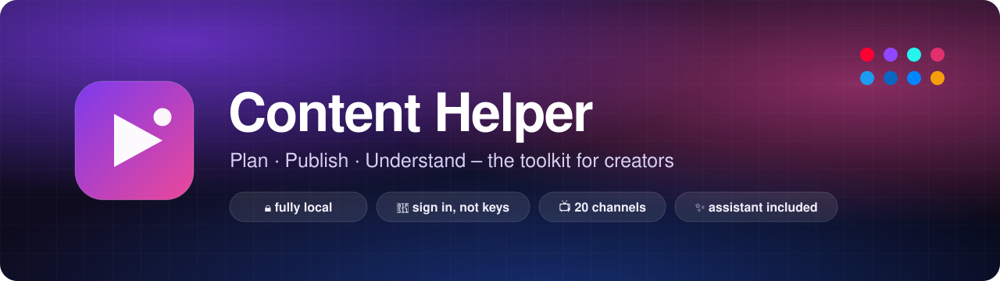
</p>

<p align="center">
  <a href="README.md">Deutsch</a> · <b>English</b>
</p>

<p align="center">
  <a href="https://github.com/MoinMornhart/content-helper/releases/latest"></a>
  <a href="https://github.com/MoinMornhart/content-helper/actions/workflows/pruefung.yml"></a>
  
  <a href="LICENSE"></a>
</p>

<p align="center">
  <b>The toolkit for creators.</b><br>
  Plan posts for 20 channels, learn from your own numbers what actually works –<br>
  and keep everything on your own PC. No subscription, no account with us –<br>
  YouTube without any keys, Twitch with your own sign-in.
</p>

<p align="center">
  <a href="https://github.com/MoinMornhart/content-helper/releases/latest"><b>⬇&nbsp; Download for Windows</b></a>
  &nbsp;·&nbsp; <a href="https://moinmornhart.github.io/content-helper/en/">Website</a>
  &nbsp;·&nbsp; <a href="#features">Features</a>
  &nbsp;·&nbsp; <a href="#how-it-works">How it works</a>
  &nbsp;·&nbsp; <a href="#what-runs-automatically">What runs automatically</a>
  &nbsp;·&nbsp; <a href="#development">Development</a>
</p>

<p align="center">
  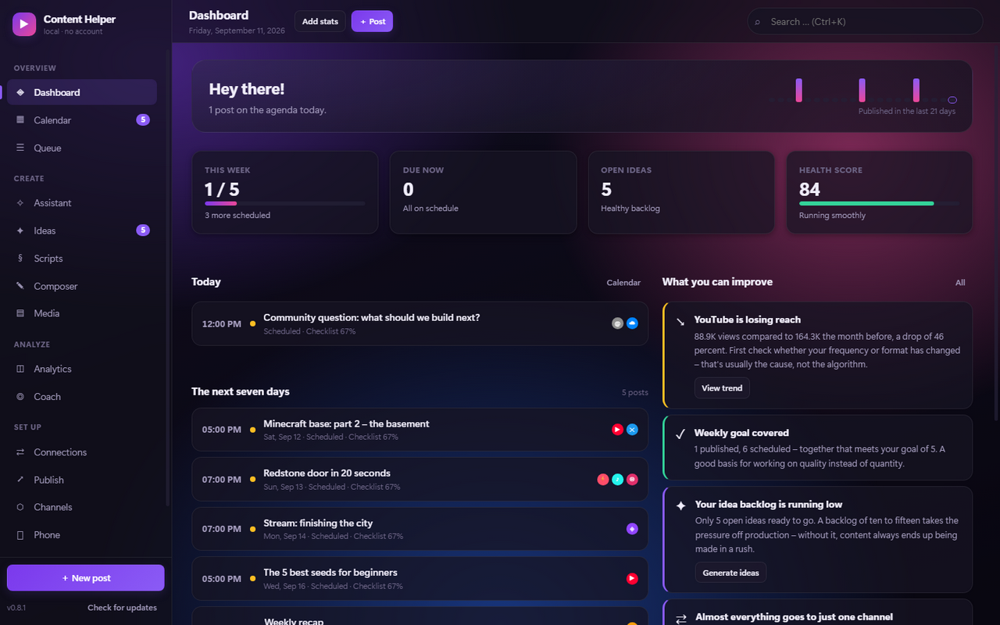
</p>

---

## Why Content Helper

Scheduling tools plan. YouTube Studio analyzes. Notion collects ideas. Content Helper brings all three
together – and looks at **your** numbers, not generic advice.

The app speaks **English and German**. It follows your Windows language and can be switched any time
under *Settings → Appearance*.

|  | Content Helper |
| --- | --- |
| **Account with a provider** | none – the app is yours |
| **Cost** | free, for good |
| **Where is your data?** | as readable files on your PC |
| **API keys or developer apps** | none for YouTube; for Twitch you sign in with your account – plus a one-time client ID, because Twitch only serves registered apps |
| **Several PCs** | linked with a code, encrypted through your OneDrive, Dropbox or Google Drive folder |
| **Publishing** | automatically at the scheduled time on YouTube, TikTok, Instagram, Facebook, LinkedIn and X |
| **Updates** | downloads itself in the background and installs on the next restart |

---

## Features

<table>
  <tr>
    <td width="50%" valign="top">
      <h3>✧ Assistant</h3>
      <p>Finds out <b>what works for you</b> – and suggests what to make next.
      If "Minecraft" does 3.5 times better than the rest of your videos, you get concrete next videos
      with ready-made titles, the right format and the time slot that has worked best for you so far.</p>
      <p>Every suggestion states its basis. With fewer than five measured posts the assistant declines
      to judge – two videos are not a pattern.</p>
    </td>
    <td width="50%">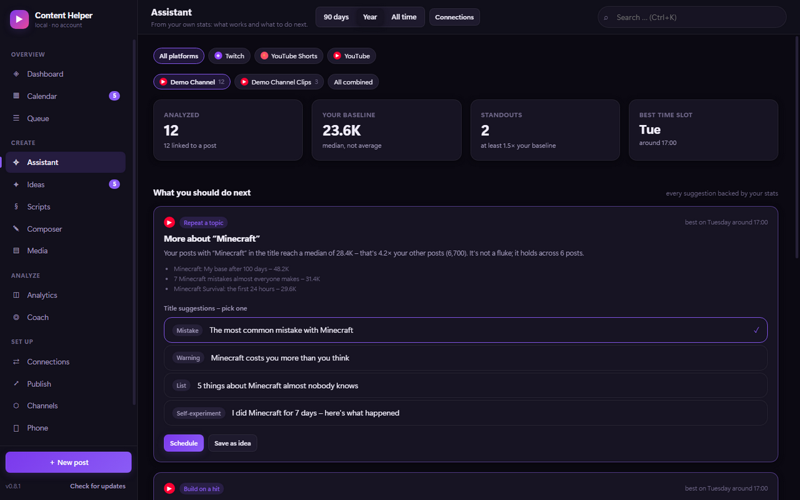</td>
  </tr>
  <tr>
    <td width="50%">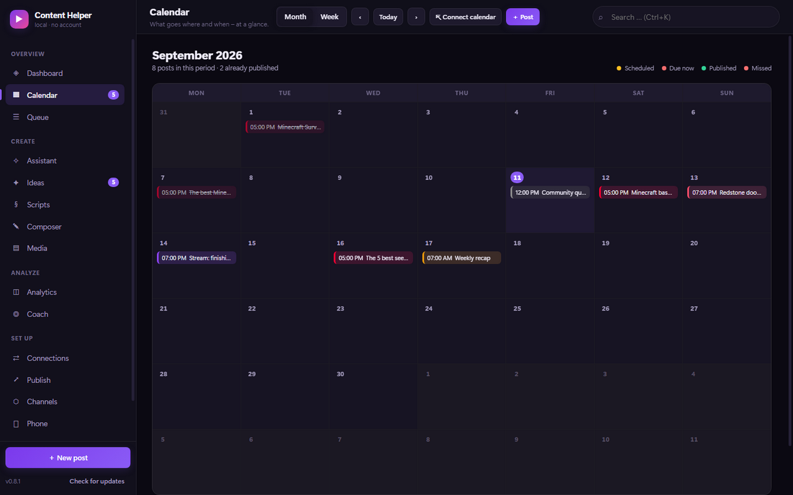</td>
    <td width="50%" valign="top">
      <h3>▦ Calendar and queue</h3>
      <p>Month and week view, reschedule by dragging, posts in the color of their channel.
      In the <b>queue</b> you set fixed time slots – finished posts slide into them in order.</p>
      <p>Your plan can be <b>subscribed to in Apple Calendar and Outlook</b> and updates itself there,
      or exported as a file into any calendar.</p>
    </td>
  </tr>
  <tr>
    <td width="50%" valign="top">
      <h3>✎ Composer</h3>
      <p>One text, every channel. On the right you see a preview for each platform with its character
      limit – whatever would be cut off is highlighted in red. Where a channel needs its own version,
      it gets one.</p>
      <p>Pick a video, tick the channels, set a time – the post goes out by itself. A text check flags
      the most common reach killers: greetings at the start, filler words, long sentences, missing
      paragraphs, too much speaking time.</p>
    </td>
    <td width="50%">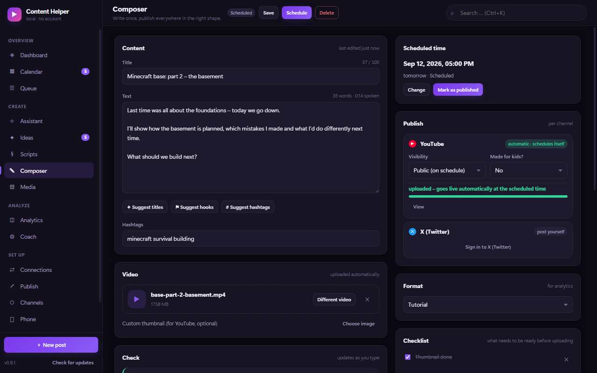</td>
  </tr>
  <tr>
    <td width="50%">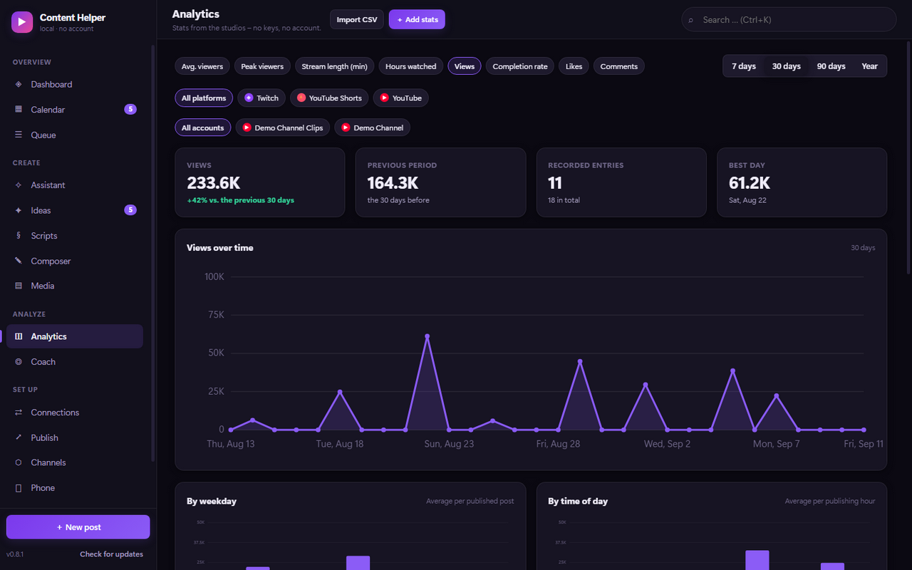</td>
    <td width="50%" valign="top">
      <h3>◫ Analytics and Coach</h3>
      <p>Trends, comparison with the previous period, breakdowns by weekday, time, channel and format,
      plus your strongest posts. Several channels are analyzed <b>separately</b> – a small and a big
      channel in one pot would distort every conclusion.</p>
      <p>The <b>Coach</b> checks 19 rules against your numbers: empty calendar, dropping frequency,
      weak click-through rate, short watch time, best time slot, remakes worth doing and more.</p>
    </td>
  </tr>
  <tr>
    <td width="50%" valign="top">
      <h3>⇄ Connections</h3>
      <p><b>YouTube</b> only needs your channel name – as many channels as you like, no keys.
      <b>Twitch</b> is connected by signing in; while you are live, the viewer count is recorded every
      two minutes, giving you the average and peak for each stream.</p>
      <p>Everything syncs automatically every 20 minutes. Values you entered by hand stay untouched.</p>
    </td>
    <td width="50%">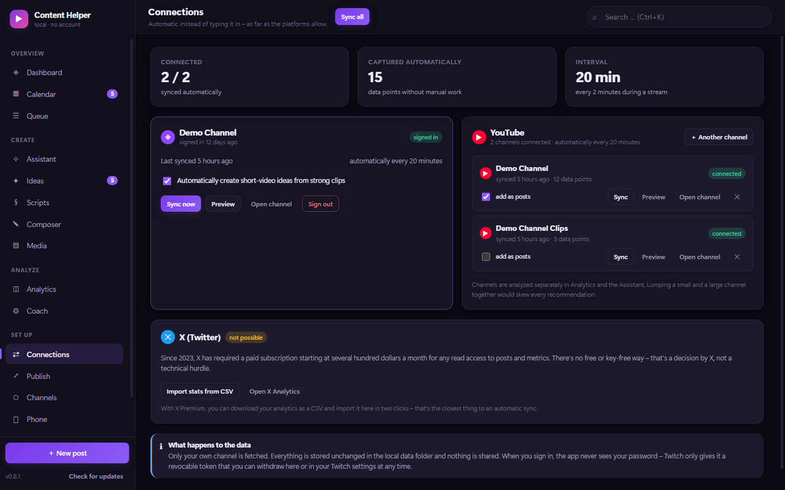</td>
  </tr>
  <tr>
    <td width="50%">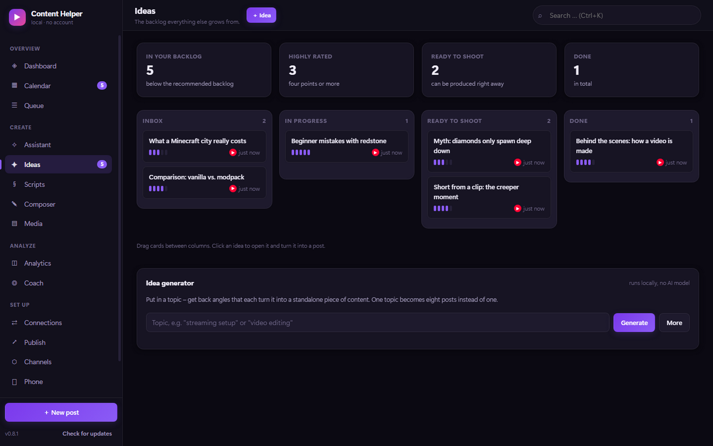</td>
    <td width="50%" valign="top">
      <h3>✦ Ideas, scripts and media</h3>
      <p>The idea board takes ideas from inbox to done. The <b>idea generator</b> turns a topic into
      eight distinct angles – rule-based and local, no AI service.</p>
      <p>The <b>script workshop</b> gives you sections with target times and counts the speaking time.
      The <b>media library</b> keeps videos and images with tags.</p>
    </td>
  </tr>
  <tr>
    <td width="50%" valign="top">
      <h3>⚙ Your look</h3>
      <p>Light or dark, nine accent colors plus a free color picker, eight ready-made backgrounds –
      or <b>your own image</b> with an adjustable veil so text stays readable.</p>
      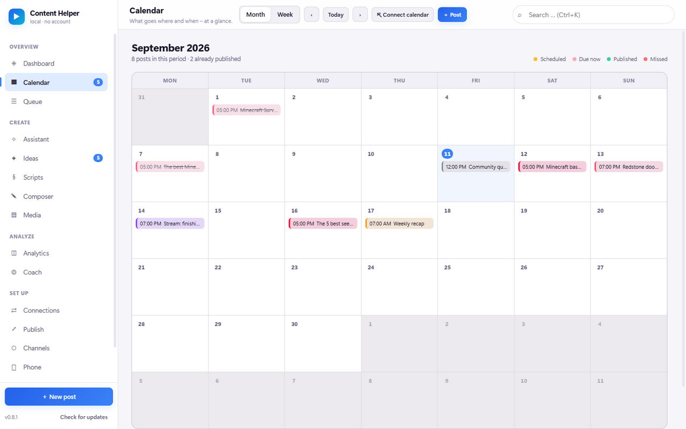
    </td>
    <td width="50%">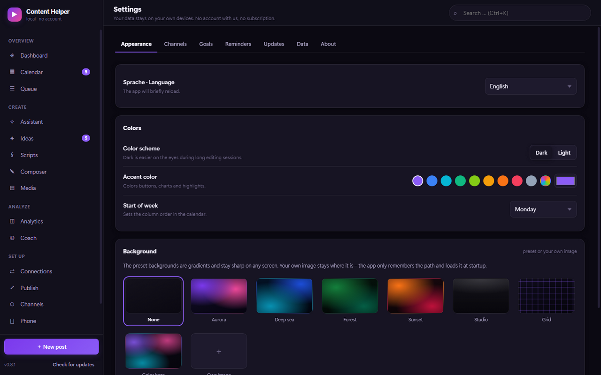</td>
  </tr>
</table>

**Also:** a **phone companion** for iPhone and Android. On your own Wi-Fi the desktop app serves an
installable web app – scan the QR code, add it to your home screen. Capture ideas on the go, tick off
posts, enter numbers; if the PC is off, it catches up later.

**Several PCs:** streaming PC at home, laptop on the road – both see the same posts, ideas and
numbers. The first PC creates a code, the second one enters it. The transport is a folder you already
sync with OneDrive, Dropbox, Google Drive or iCloud; there is no account and no server. The code is
also the key – the cloud folder only ever contains encrypted data (AES-256).

<p align="center">
  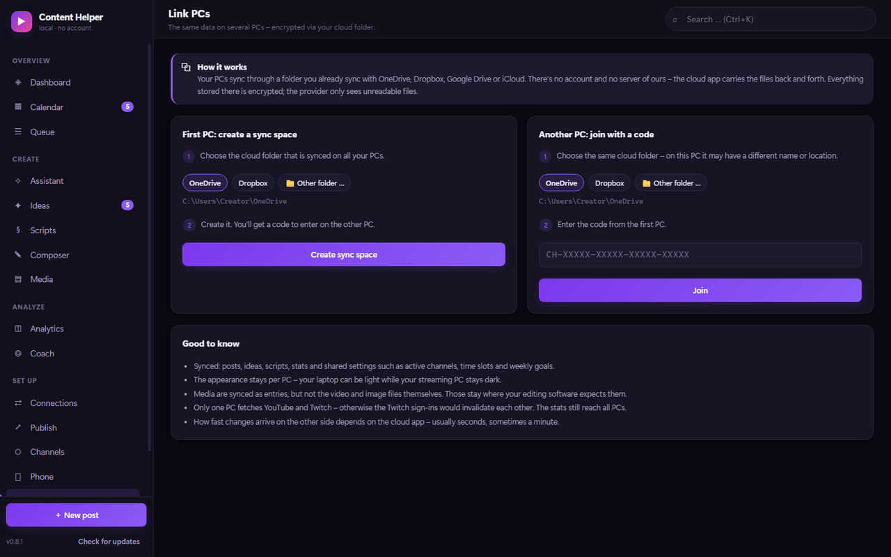
</p>

---

## How it works

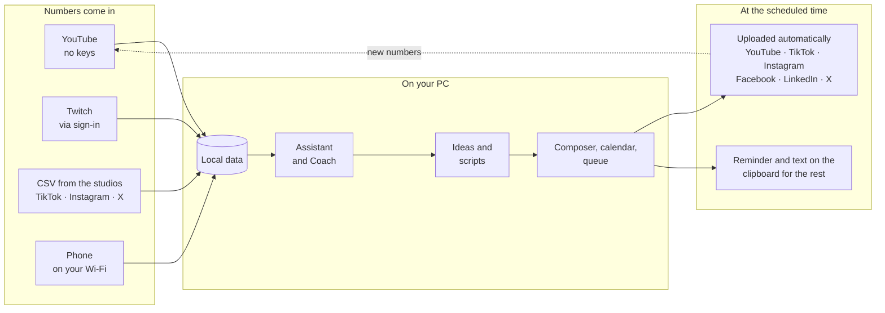

The loop is what matters: what you publish comes back as numbers, the assistant learns from it, and
the next suggestion gets sharper.

---

## What runs automatically

Not everything you might wish for is allowed by the platforms. Here is the honest picture:

| Channel | Fetching numbers | How |
| --- | :---: | --- |
| **YouTube** | ✅ automatic | via the public channel feed, any number of channels, **no key** |
| **Twitch** | ✅ automatic | via sign-in; a one-time client ID, because Twitch only serves registered apps |
| **TikTok, Instagram, Facebook …** | 📄 by file | CSV export from each studio, imported in two clicks |
| **X (Twitter)** | 📄 by file | read access at X has cost several hundred dollars a month since 2023 |

### Publishing

Sign in once under *Setup → Publishing*, then pick a video in the Composer, tick the channels, set a
time – the post goes out by itself.

| Channel | Publishing | When |
| --- | :---: | --- |
| **YouTube, Shorts** | ✅ automatic | uploaded right away, YouTube releases it at the scheduled time – **your PC may be off** |
| **Facebook Page** | ✅ automatic | uploaded in advance, Facebook publishes at the scheduled time – **your PC may be off** |
| **TikTok** | ✅ automatic | at the scheduled time, PC must be running |
| **Instagram Reels** | ✅ automatic | at the scheduled time, PC must be running (professional account linked to a Facebook Page) |
| **LinkedIn** | ✅ automatic | at the scheduled time, PC must be running |
| **X** | ✅ automatic | at the scheduled time, PC must be running |
| **Threads, Bluesky, Discord …** | 🔔 reminder | at the scheduled time the text is on your clipboard |

If an upload breaks off, the app resumes at the same spot – even after a restart. After errors it
retries with growing pauses; anything that fails for good is reported with the reason.

<p align="center">
  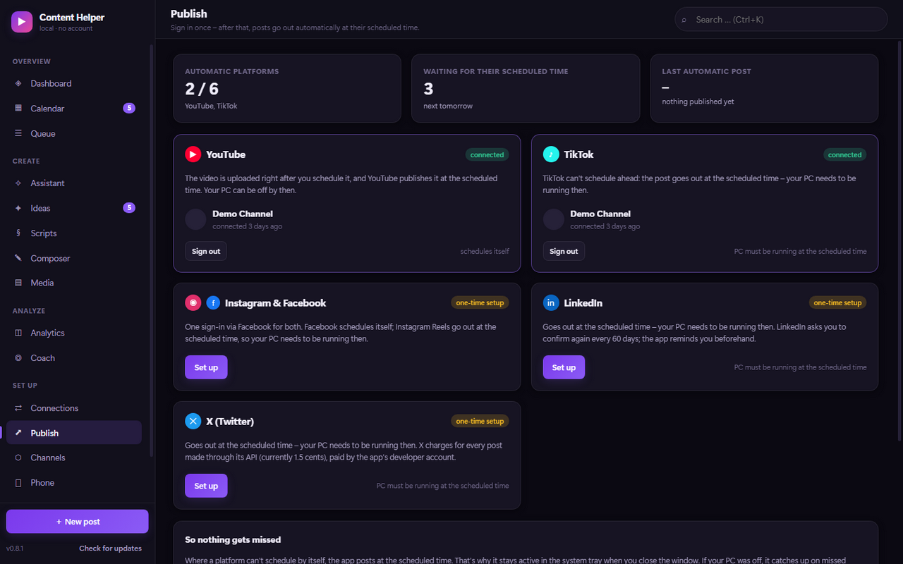
</p>

**To be honest:** every platform only accepts uploads from an app that is registered and reviewed by
it. Until YouTube and TikTok have reviewed the Content Helper app, uploads land there as "private".
How to set up the apps is described in [docs/PUBLISHING.md](docs/PUBLISHING.md) – in the app,
*Set up* opens the right page and fills in whatever you copy there by itself.

**No server:** your own PC does the posting. Where a platform cannot schedule by itself, the PC has to
be running at the scheduled time – when you close the window, the app keeps running in the system
tray and can start with Windows.

---

## Installation

1. **[Download the latest version](https://github.com/MoinMornhart/content-helper/releases/latest)** –
   `Content-Helper-Setup-….exe` to install, or the portable `.exe` without installation.
2. On first start Windows SmartScreen shows a warning because the file is not signed:
   *More info → Run anyway*.
3. Done. **Updates arrive by themselves:** the app checks on every start, downloads new versions in
   the background and installs them on the next restart – or right away via "Restart and install" in
   the sidebar.

## Your data

Everything is stored as readable JSON in your user profile under `%APPDATA%\Content Helper\data`.
No cloud requirement, no telemetry. A snapshot is saved automatically every day, and in the settings
you can export and re-import a full backup at any time.

When you link several PCs, the app creates a subfolder `Content Helper Sync` in the chosen cloud
folder. Each PC only writes its own files there – so no conflict copies appear – and everything is
encrypted with the code. With simultaneous changes the newer one wins; deleted items stay deleted.
Each PC keeps its own look.

---

## Development

```bash
npm install              # get Electron
npm start                # start the app
npm run dev              # with developer tools
npm test                 # all checks (see below)
npm run screenshots      # regenerate the German screenshots for the README
npm run screenshots:en   # regenerate the English screenshots
npm run dist             # build the Windows installer
```

Requires Node.js 20 or newer. The UI has no framework and no build step; at runtime only
`electron-updater` is needed for self-updating.

**Translations:** German text in the code is also the key – `t('Gespeichert.')` shows "Saved." in
English. The English texts live in `src/shared/i18n/en/*.json`; `npm run test:i18n` reports any text
that is missing a translation.

**Checks** – also run on GitHub for every change:

| Command | checks |
| --- | --- |
| `npm run lint` | syntax of all modules |
| `npm run test:i18n` | every text has an English translation, placeholders match |
| `npm run test:connectors` | YouTube and Twitch connection, several channels, empty channels – offline |
| `npm run test:calendar` | calendar files per RFC 5545: folding, escaping, stable IDs |
| `npm run test:companion` | the phone companion's Wi-Fi server from the outside, including access control |
| `npm run test:sync` | three simulated PCs sharing a cloud folder: conflicts, deletions, encryption, outages |
| `npm run test:publish` | publishing offline: timing, retries, resuming, never twice – and every platform step by step |
| `npm test` | everything above, plus a smoke test of all views in German and English |

**Release a new version:**

```bash
npm version minor
git push origin main --tags
```

GitHub then builds the installer and the portable version and attaches them to the release. All
installed apps fetch the update from there.

---

<p align="center">
  Roadmap (German): <a href="docs/ROADMAP.md">docs/ROADMAP.md</a> · License: <a href="LICENSE">MIT</a>
</p>
