<p align="center">
  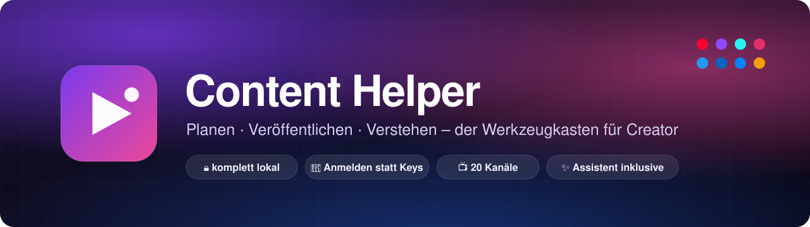
</p>

<p align="center">
  <a href="https://github.com/MoinMornhart/content-helper/releases/latest"></a>
  <a href="https://github.com/MoinMornhart/content-helper/actions/workflows/pruefung.yml"></a>
  
  <a href="LICENSE"></a>
</p>

<p align="center">
  <b>Der Werkzeugkasten für Creator.</b><br>
  Beiträge für 20 Kanäle planen, aus den eigenen Zahlen erfahren, was wirklich funktioniert –<br>
  und dabei alles auf dem eigenen PC behalten. Ohne Konto, ohne Abo, ohne API-Schlüssel.
</p>

<p align="center">
  <a href="https://github.com/MoinMornhart/content-helper/releases/latest"><b>⬇&nbsp; Für Windows herunterladen</b></a>
  &nbsp;·&nbsp; <a href="#funktionen">Funktionen</a>
  &nbsp;·&nbsp; <a href="#so-funktionierts">So funktioniert’s</a>
  &nbsp;·&nbsp; <a href="#was-automatisch-geht">Was automatisch geht</a>
  &nbsp;·&nbsp; <a href="#entwicklung">Entwicklung</a>
</p>

<p align="center">
  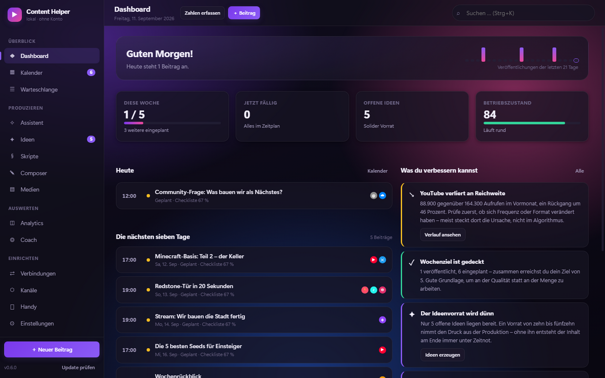
</p>

---

## Warum Content Helper

Buffer plant. YouTube Studio wertet aus. Notion sammelt Ideen. Content Helper verbindet alle drei –
und schaut dabei auf **deine** Zahlen, nicht auf allgemeine Ratschläge.

|  | Content Helper |
| --- | --- |
| **Konto oder Anmeldung beim Anbieter** | keins – die App gehört dir |
| **Kosten** | keine, dauerhaft |
| **Wo liegen deine Daten?** | als lesbare Dateien auf deinem PC |
| **API-Schlüssel oder Developer-Apps** | für YouTube keine, für Twitch einmalig eine Client-ID |
| **Aktualisierung** | lädt sich selbst im Hintergrund und spielt sich beim Neustart ein |

---

## Funktionen

<table>
  <tr>
    <td width="50%" valign="top">
      <h3>✧ Assistent</h3>
      <p>Findet heraus, <b>was bei dir funktioniert</b> – und schlägt vor, was als Nächstes kommt.
      Läuft etwa „Minecraft“ bei dir 3,5-mal besser als der Rest, bekommst du konkrete nächste Videos
      mit fertigen Titeln, dem passenden Format und dem Zeitfenster, das bei dir bisher am besten lief.</p>
      <p>Jeder Vorschlag nennt seine Grundlage. Unter fünf gemessenen Beiträgen verweigert der
      Assistent die Aussage – aus zwei Videos lässt sich kein Muster ableiten.</p>
    </td>
    <td width="50%">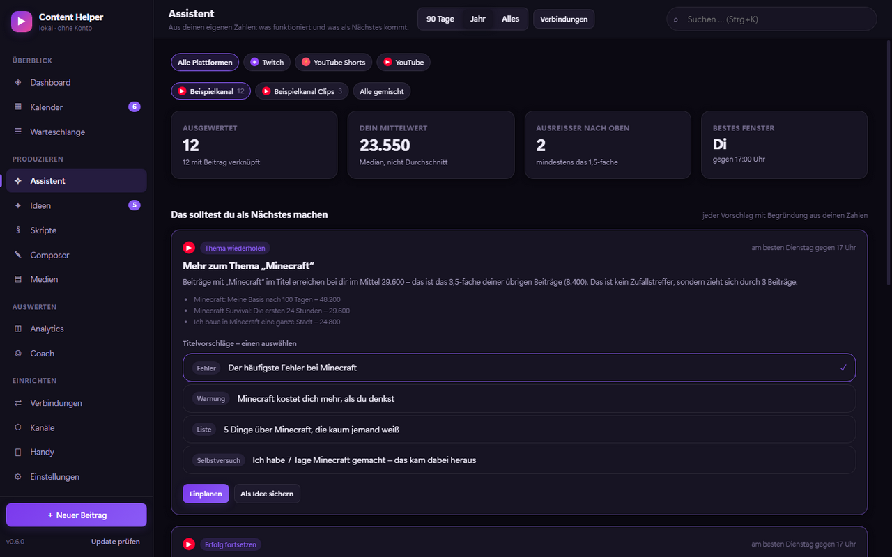</td>
  </tr>
  <tr>
    <td width="50%">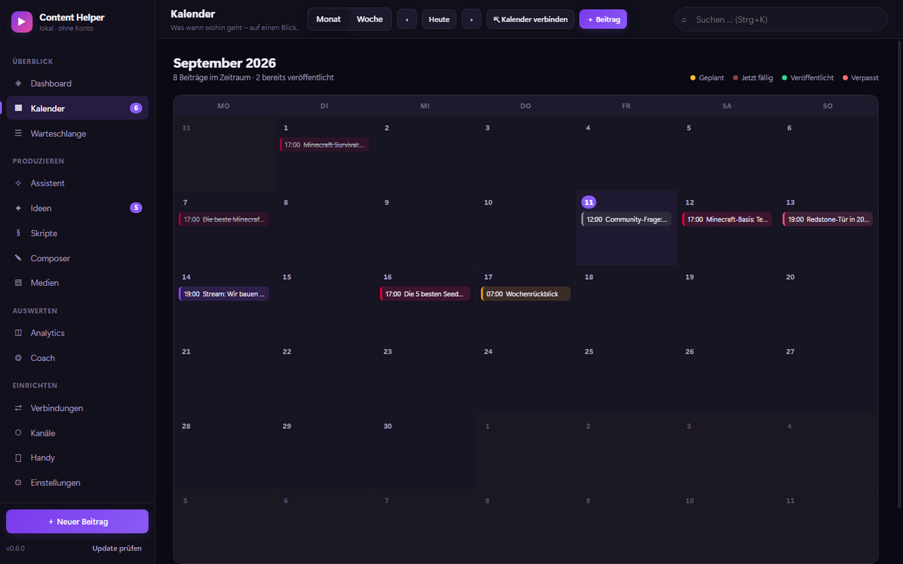</td>
    <td width="50%" valign="top">
      <h3>▦ Kalender und Warteschlange</h3>
      <p>Monats- und Wochenansicht, Umplanen per Ziehen, Beiträge in der Farbe ihres Kanals.
      In der <b>Warteschlange</b> legst du wie bei Buffer feste Zeitfenster an – fertige Beiträge
      rutschen der Reihe nach hinein.</p>
      <p>Der Plan lässt sich in <b>Apple Kalender und Outlook abonnieren</b> und aktualisiert sich dort
      von selbst, oder als Datei in jeden Kalender übernehmen.</p>
    </td>
  </tr>
  <tr>
    <td width="50%" valign="top">
      <h3>✎ Composer</h3>
      <p>Ein Text, alle Kanäle. Rechts steht für jede Plattform eine Vorschau mit Zeichenlimit –
      was abgeschnitten würde, ist rot hinterlegt. Wo ein Kanal eine eigene Fassung braucht,
      bekommt er sie.</p>
      <p>Eine Textprüfung meldet die häufigsten Reichweitenbremsen: Begrüßung am Anfang,
      Füllwörter, zu lange Sätze, fehlende Absätze, zu lange Sprechzeit.</p>
    </td>
    <td width="50%">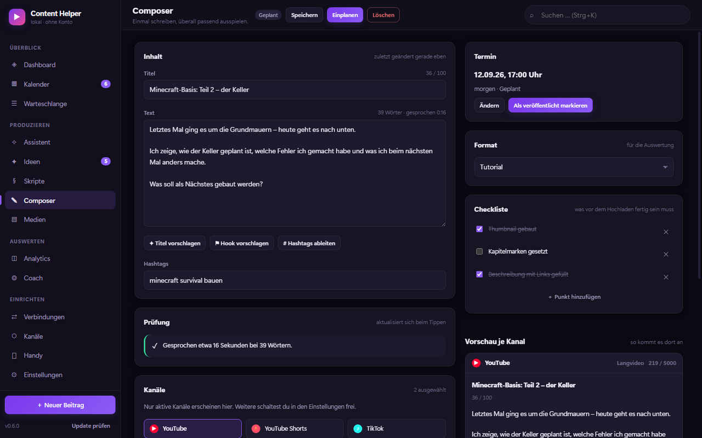</td>
  </tr>
  <tr>
    <td width="50%">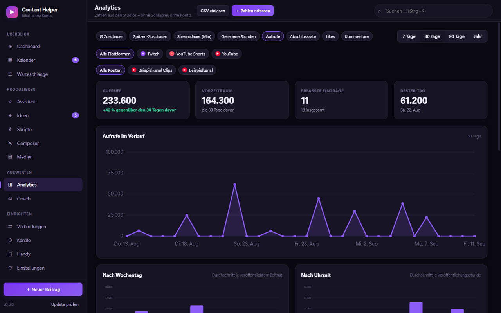</td>
    <td width="50%" valign="top">
      <h3>◫ Analytics und Coach</h3>
      <p>Verlauf, Vergleich mit dem Vorzeitraum, Auswertung nach Wochentag, Uhrzeit, Kanal und Format,
      dazu die stärksten Einzelbeiträge. Mehrere Kanäle werden <b>getrennt</b> ausgewertet –
      ein kleiner und ein großer Kanal im selben Topf würden jede Aussage verfälschen.</p>
      <p>Der <b>Coach</b> prüft 19 Regeln gegen deine Zahlen: leerer Kalender, brechende Frequenz,
      schwache Klickrate, kurze Wiedergabe, bestes Zeitfenster, lohnende Neuauflagen und mehr.</p>
    </td>
  </tr>
  <tr>
    <td width="50%" valign="top">
      <h3>⇄ Verbindungen</h3>
      <p><b>YouTube</b> braucht nur den Kanalnamen – beliebig viele Kanäle, ohne Schlüssel.
      <b>Twitch</b> verbindest du per Anmeldung; während du live bist, wird alle zwei Minuten die
      Zuschauerzahl festgehalten, daraus entstehen Durchschnitt und Spitzenwert je Stream.</p>
      <p>Alle 20 Minuten wird automatisch abgeglichen. Von Hand ergänzte Werte bleiben dabei unangetastet.</p>
    </td>
    <td width="50%">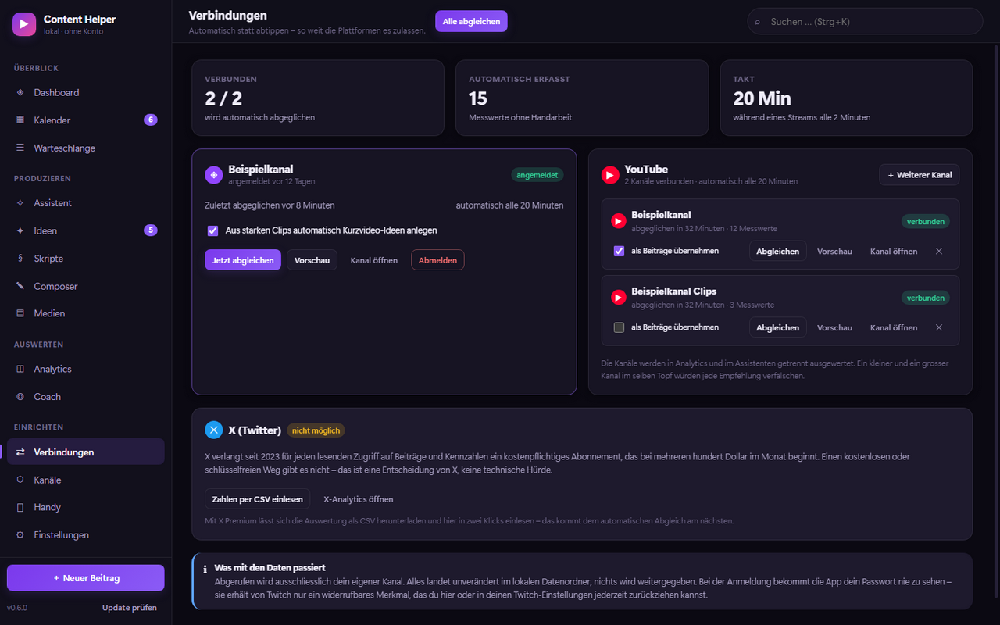</td>
  </tr>
  <tr>
    <td width="50%">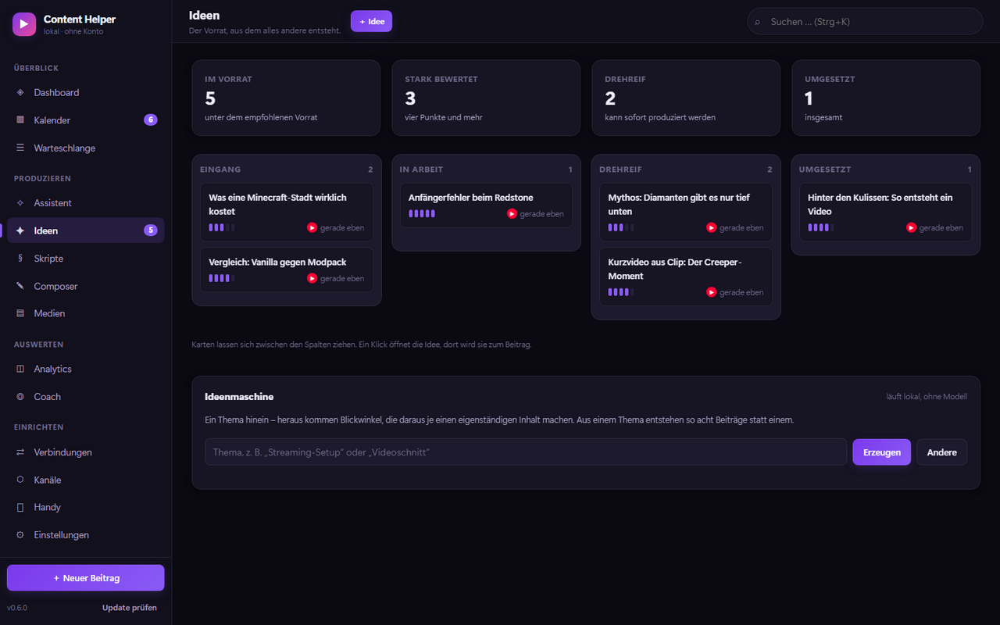</td>
    <td width="50%" valign="top">
      <h3>✦ Ideen, Skripte und Medien</h3>
      <p>Das Ideenbrett führt Ideen vom Eingang bis zur Umsetzung. Die <b>Ideenmaschine</b> macht aus
      einem Thema acht eigenständige Blickwinkel – regelbasiert und lokal, ohne KI-Dienst.</p>
      <p>Die <b>Skript-Werkstatt</b> gibt Abschnitte mit Zielzeit vor und rechnet die Sprechdauer mit.
      Die <b>Medienbibliothek</b> verwaltet Videos und Bilder mit Schlagwörtern.</p>
    </td>
  </tr>
  <tr>
    <td width="50%" valign="top">
      <h3>⚙ Dein Aussehen</h3>
      <p>Hell oder dunkel, neun Akzentfarben plus freie Farbwahl, acht vorgefertigte Hintergründe –
      oder ein <b>eigenes Bild</b> mit regelbarem Schleier, damit Text lesbar bleibt.</p>
      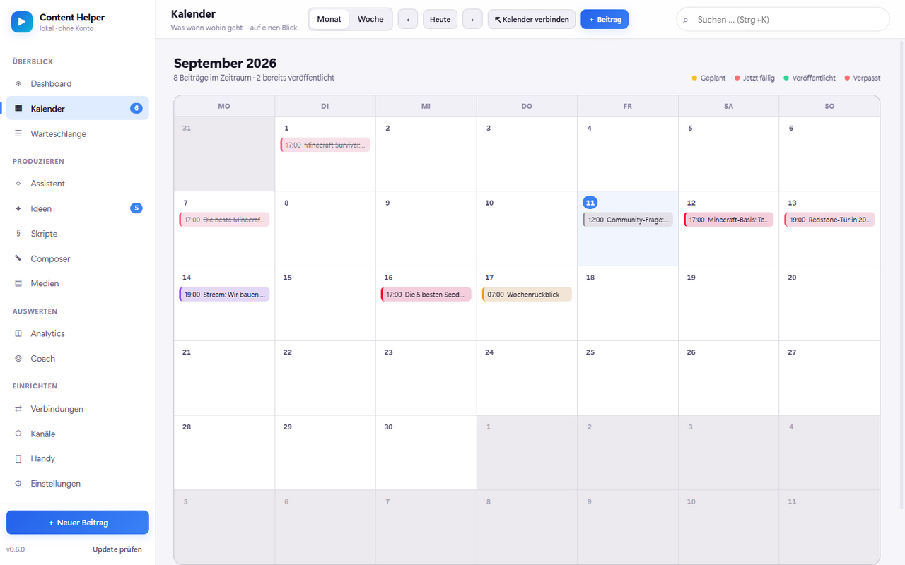
    </td>
    <td width="50%">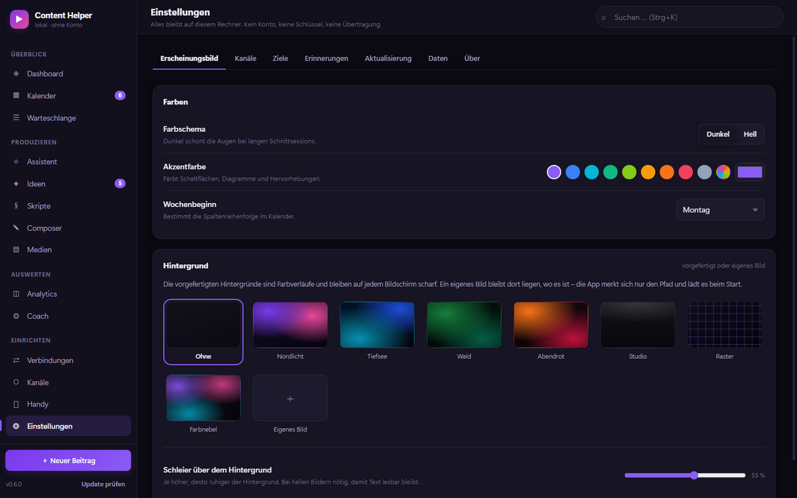</td>
  </tr>
</table>

**Außerdem:** ein **Handy-Begleiter** für iPhone und Android. Im eigenen WLAN liefert die Desktop-App
eine installierbare Web-App aus – QR-Code scannen, zum Startbildschirm hinzufügen. Unterwegs
Ideen festhalten, Beiträge abhaken, Zahlen eintragen; ist der PC aus, wird später nachgereicht.

---

## So funktioniert’s

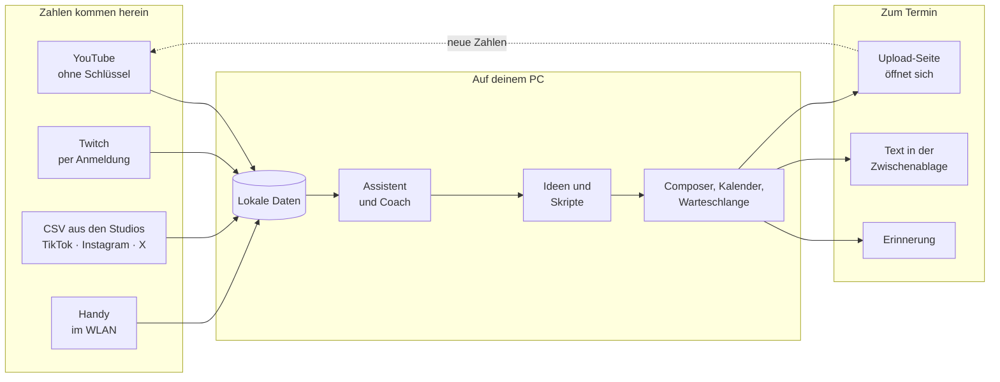

Der Kreislauf ist das Entscheidende: Was du veröffentlichst, kommt als Zahl zurück, der Assistent
lernt daraus, und der nächste Vorschlag wird genauer.

---

## Was automatisch geht

Nicht alles, was man sich wünscht, lassen die Plattformen zu. Hier steht ehrlich, wie es aussieht:

| Kanal | Zahlen holen | Wie |
| --- | :---: | --- |
| **YouTube** | ✅ automatisch | über den offenen Kanal-Feed, beliebig viele Kanäle, **kein Schlüssel** |
| **Twitch** | ✅ automatisch | per Anmeldung; einmalig eine Client-ID, weil Twitch nur registrierte Anwendungen bedient |
| **TikTok, Instagram, Facebook …** | 📄 per Datei | CSV-Export aus dem jeweiligen Studio, in zwei Klicks eingelesen |
| **X (Twitter)** | 📄 per Datei | lesender Zugriff kostet bei X seit 2023 mehrere hundert Dollar im Monat |

**Veröffentlichen:** Zum Termin meldet sich die App, legt Text und Hashtags in die Zwischenablage und
öffnet auf Wunsch die Upload-Seite. Das echte Hochladen zu YouTube ist in Arbeit – es setzt eine
eigene Google-Anwendung voraus, und bis Google sie prüft, landen Uploads auf „privat“.

**Dein PC muss laufen:** Anders als bei Buffer gibt es keinen Server, der um drei Uhr nachts für dich
postet. Termine, Abgleich und Kalender-Abo funktionieren, solange die App läuft – beim Schließen
bleibt sie deshalb im Infobereich aktiv.

---

## Installation

1. **[Neueste Version herunterladen](https://github.com/MoinMornhart/content-helper/releases/latest)** –
   `Content-Helper-Setup-….exe` zum Installieren oder die portable `.exe` ohne Installation.
2. Beim ersten Start meldet sich Windows SmartScreen, weil die Datei nicht signiert ist:
   *Weitere Informationen → Trotzdem ausführen*.
3. Fertig. **Updates kommen von selbst:** Die App prüft beim Start, lädt neue Fassungen im Hintergrund
   und spielt sie beim nächsten Neustart ein – oder sofort über „Neu starten und einspielen“ in der
   Seitenleiste.

## Deine Daten

Alles liegt als lesbares JSON in deinem Benutzerprofil unter `%APPDATA%\Content Helper\data`.
Kein Cloud-Zwang, keine Telemetrie. Täglich wird automatisch ein Schnappschuss abgelegt, und in den
Einstellungen lässt sich jederzeit eine vollständige Sicherung exportieren und wieder einlesen.

---

## Entwicklung

```bash
npm install          # Electron holen
npm start            # App starten
npm run dev          # mit Entwicklerwerkzeugen
npm test             # alle Prüfungen (siehe unten)
npm run screenshots  # Bildschirmfotos für dieses README neu erzeugen
npm run dist         # Windows-Installer bauen
```

Voraussetzung ist Node.js 20 oder neuer. Die Oberfläche kommt ohne Framework und ohne Build-Schritt aus;
zur Laufzeit wird nur `electron-updater` für die Selbstaktualisierung gebraucht.

**Prüfungen** – laufen bei jeder Änderung auch auf GitHub:

| Befehl | prüft |
| --- | --- |
| `npm run lint` | Syntax aller Module |
| `npm run test:connectors` | YouTube- und Twitch-Anbindung, mehrere Kanäle, leere Kanäle – ohne Netz |
| `npm run test:calendar` | Kalenderdateien nach RFC 5545: Faltung, Maskierung, stabile Kennungen |
| `npm run test:companion` | den WLAN-Server des Handy-Begleiters von außen, inklusive Zugriffsschutz |
| `npm test` | alles davor, dazu einen Rauchtest über alle 14 Ansichten und den Assistenten |

**Neue Version veröffentlichen:**

```bash
npm version minor
git push origin main --tags
```

GitHub baut daraufhin Installer und portable Fassung und hängt sie an die Veröffentlichung. Von dort
holen sich alle installierten Apps das Update.

### Aufbau

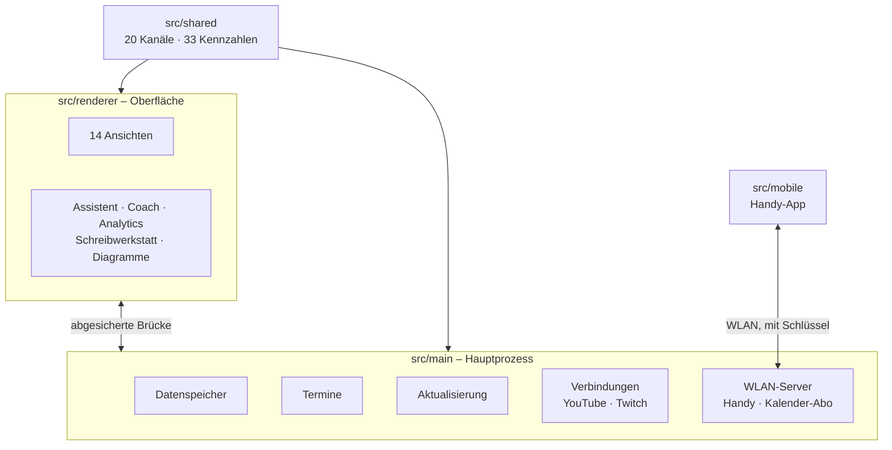

---

<p align="center">
  Stand der Ausbaustufen: <a href="docs/ROADMAP.md">Roadmap</a> · Lizenz: <a href="LICENSE">MIT</a>
</p>
